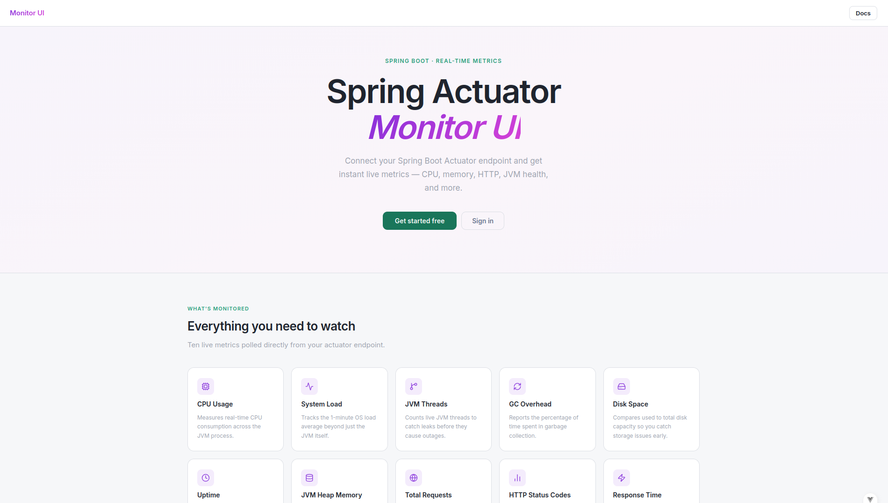

# Monitor

> A modern self-hosted Monitor UI, tailor-made for Spring Boot actuator.



## Overview

Monitor is a lightweight, self-hosted application that watches all your Spring Boot applications in real time.
You register your spring app, and Monitor starts polling all registered servers Actuator endpoints automatically,
collecting CPU, jvm memory, JVM Threads, HTTP total and status code, disk, system load, GC Overhead, Uptime, and health on every poll. 

Every poll is a snapshot, you decide how often the polling happens, you can also view live Snapshots (live charts)
of your app and history of Snapshots (table view with pagination)


#### Does Not Collect or Display
- API endpoint names including HTTP Methods
- Build info, Git commit, or application version
- Logs, log levels, or logger configuration
- Application beans or Spring components
- Environment variables or configuration properties
- Thread dumps or heap dumps
- Any internal application attributes

You see performance data only, the numbers that tell you if something is wrong, not the internals of your application.

## Features Include

- **Unlimited server registration** — add as many Spring Boot servers as you want, each with its own polling interval, settings and live charts
- **Live charts**: CPU, memory, GC overhead, HTTP status codes (2xx, 3xx, 4xx, 5xx), request latency, and system load, refreshing every 2 seconds
- **History snapshots with pagination**
- **Pause polling** Stops collecting data
- **Export Snapshots CSV**: download the complete snapshot history for any server registered
- **Snapshot size tracking**: see how much space is snapshots taking
- **Multi-user with full isolation**: each user's servers and data are completely separate
- **JWT authentication**: every API request requires a valid token
- **Passwords hashed with BCrypt**: passwords are never stored in plain text
- **CORS Protection**
- **Optional `X-Monitor-Secret` header for protecting**: more about `X-Monitor-Secret` Read below


### Getting started

No complex configuration needed, 
all you need is spring actuator dependency in your project, and these
2 lines in your 

`application.properties`.

```properties
management.endpoints.web.exposure.include=health,info,metrics
management.endpoint.health.show-details=always
```

or `application.yml`.

```yaml
management:
  endpoints:
    web:
      exposure:
        include: health,info,metrics
  endpoint:
    health:
      show-details: always
```


## Fixing HTTP Metric Inflation


### The problem

Monitor polls your `/actuator` endpoints on every cycle. By default, Spring records every incoming HTTP request,
including those poll requests, in the `http.server.requests` metric. This means:

- Your request count is inflated by monitor polls
- Your average response time is skewed by actuator response times
- Your HTTP status code breakdown includes monitor traffic mixed with real user traffic

If Monitor polls every 15 seconds and makes 14 actuator calls per cycle, that is **56 extra requests per minute** counted against your app before a single real user does anything.

### How Monitor solves it

Add this single bean to any `@Configuration` class in your monitored application:

```java
@Bean
public ObservationPredicate excludeActuatorObservations() {
    return (name, context) -> {
        if (name.equals("http.server.requests")
                && context instanceof ServerRequestObservationContext ctx) {
            return !ctx.getCarrier().getRequestURI().startsWith("/actuator");
        }
        return true;
    };
}
```

This tells Spring's observation system to stop recording `/actuator/**` requests in `http.server.requests` entirely,
at the source, before the metric is written. Your HTTP metrics then reflect only real user traffic.


## Optional Actuator Security

By default, anyone who knows your actuator URL can read it.
Monitor gives you a simple optional layer of protection.

In your Monitor UI profile, generate a secret. Monitor will then send that secret in an `X-Monitor-Secret`
header on every poll request. In your monitored application, add a filter that rejects any actuator request missing that header.

**Spring MVC:**
```java
@Component
public class MonitorSecretFilter implements Filter {

    @Value("${monitor.secret:#{null}}")
    private String expectedSecret;

    @Override
    public void doFilter(ServletRequest request, ServletResponse response, FilterChain chain)
            throws IOException, ServletException {
        HttpServletRequest req = (HttpServletRequest) request;
        if (req.getRequestURI().startsWith("/actuator") && expectedSecret != null) {
            String secret = req.getHeader("X-Monitor-Secret");
            if (!expectedSecret.equals(secret)) {
                ((HttpServletResponse) response).setStatus(HttpStatus.UNAUTHORIZED.value());
                return;
            }
        }
        chain.doFilter(request, response);
    }
}
```

**Spring WebFlux:**
```java
@Component
public class MonitorSecretFilter implements WebFilter {

    @Value("${monitor.secret:#{null}}")
    private String expectedSecret;

    @Override
    public Mono<Void> filter(ServerWebExchange exchange, WebFilterChain chain) {
        String path = exchange.getRequest().getPath().value();
        if (path.startsWith("/actuator") && expectedSecret != null) {
            String secret = exchange.getRequest().getHeaders().getFirst("X-Monitor-Secret");
            if (!expectedSecret.equals(secret)) {
                exchange.getResponse().setStatusCode(HttpStatus.UNAUTHORIZED);
                return exchange.getResponse().setComplete();
            }
        }
        return chain.filter(exchange);
    }
}
```

Then set the secret in your monitored app's `application.properties`:
```properties
monitor.secret=your-secret-here
```

This is entirely optional, if you thinking of deploying the minitor and dont want any other server or
person to call actuators except the monitor, monitor will allways pass secret in the header if generated, so you can exclude
any request made to your app that doesnt have the secret.

If you do not add the filter, actuator remains accessible as normal.

> HTTPS is strongly recommended when using this feature. The secret travels in a request header and must be encrypted in transit to provide real protection.

## Why Monitor Exists

Most Spring Boot monitoring solutions fall into one of two problems:

**Too much setup.** Prometheus + Grafana is powerful, but you need to install Prometheus, configure scrape targets, add
a Micrometer registry dependency to every app, set up Grafana, import a dashboard, and wire it all together. That is a 
significant investment before you see a single chart.

**Bad UI.** The tools that are easy to set up tend to have dashboards that feel old. 

**Monitor** is the answer to both. It connects directly to Spring's built-in Actuator endpoints,
no extra dependencies, no complex YAML configuration.
its clean, has modern UI designed around two question: *what do I need to know to troubleshoot this?* and 
*How do i not leak sensitive data* just as bean, logs exc...


**Built for:** small teams, solo developers, and technical project managers who want visibility without an operations team.


## Running with Docker Compose

The fastest way to run everything, backend, frontend, and database in one command.

```bash
docker compose up -d --build
```

Open your browser at `http://localhost:8173`

To stop everything:
```bash
docker compose down
```

### Monitoring apps running on your host machine

When the backend runs inside Docker, `localhost` refers to the container not your machine. To monitor a Spring Boot app running locally, use `host.docker.internal` as the hostname:

```
http://host.docker.internal:8080
```

This works automatically on Mac and Windows. On Linux it is handled by the `extra_hosts` entry already present in `docker-compose.yml`.

---

## Running Locally

Keep only the database in Docker and run the backend and frontend directly on your machine.

**1. Start only the database:**
```bash
docker compose up -d monitor-database
```

**2. Run the backend:**
```bash
./mvnw spring-boot:run -Dspring-boot.run.profiles=dev
```

**3. Run the frontend:**
```bash
cd monitor-ui
bun install
bun run dev
```

Open `http://localhost:5173`

### Requirements
- JDK 25
- Maven
- Bun
- Docker
